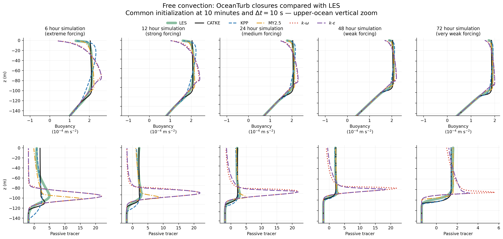
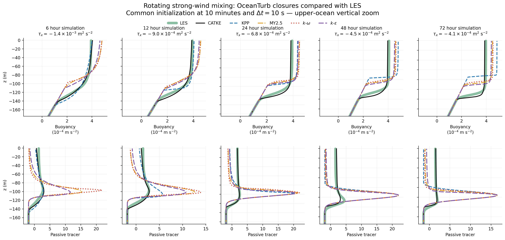

# OceanTurb.jl

| **Documentation**             | **Build Status**                    | **License** |
|:-----------------------------:|:-----------------------------------:|:-----------:|
| [![docs][docs-img]][docs-url] | [![travis][travis-img]][travis-url] |[](https://mit-license.org/)|


`OceanTurb.jl` is an experimental research fork of
[the original OceanTurb.jl](https://github.com/glwagner/OceanTurb.jl).
It provides a compact Julia framework for one-dimensional models of
turbulent mixing in the ocean surface and bottom boundary layers.

This fork extends the original collection of boundary-layer
parameterizations with prognostic turbulence closures commonly used in
ocean modeling. Its main purpose is to make these closures easy to
inspect, configure, test, and compare within a shared numerical
framework.

## Current additions

| Component | Formulation in this fork | Status |
|:----------|:-------------------------|:-------|
| Mellor--Yamada level 2.5 (`MellorYamada25`) | Prognostic turbulent kinetic energy and \(q^2\ell\), with Kantha--Clayson weak-equilibrium stability functions | Implemented, tested, and documented |
| Oceanic \(k\)-\(\omega\) (`KOmega`) | Prognostic turbulent kinetic energy and specific dissipation rate, with Canuto-A stability functions | Implemented, tested, and documented |
| Oceanic \(k\)-\(\epsilon\) (`KEpsilon`) | Prognostic turbulent kinetic energy and dissipation rate, with Canuto-A stability functions | Implemented, tested, and documented |
| CATKE (`CATKE`) | One-equation convective-adjustment turbulent kinetic energy closure | Implemented, tested, and documented |
| LES-based examples | Free convection and rotating strong-wind mixing, corresponding to the physical cases underlying Figures 5 and 7 of Wagner et al. (2025) | Included |

The new prognostic closures use oceanic coefficient sets derived from
the General Ocean Turbulence Model (GOTM), native turbulence
initialization, and logarithmic wall boundary conditions. Development
of slope-following bottom-boundary-layer formulations remains a future
research direction.

This research version is developed on the `more-schemes` branch. Open
[Julia](https://julialang.org), press `]` to enter package-manager mode,
and install it directly from GitHub:

```julia
pkg> add https://github.com/chyurenpo/OceanTurb.jl#more-schemes
```

## Turbulence models

OceanTurb also retains the original diffusion, KPP, modular KPP,
Pacanowski--Philander, and TKE mass-flux models. See the
[model documentation](docs/src/models/) or [`src/models/`](src/models/)
for formulations, parameters, and construction examples.

## Paper-based examples

The [`examples/`](examples/) directory contains two cases using the
official large-eddy simulation profiles from Wagner et al. (2025):

- free-convection LES cases; and
- rotating strong-wind LES cases.

Both workflows evaluate CATKE, KPP, Mellor--Yamada 2.5,
\(k\)-\(\omega\), and \(k\)-\(\epsilon\) from common LES initial
conditions. They reproduce the physical configurations rather than
every detail of the manuscript calculations. See
[`examples/README.md`](examples/README.md) for instructions, data
provenance, and interpretation.





## Authors and contributors

- [Gregory Wagner](https://glwagner.github.io) — original author of OceanTurb.jl.
- [Chunyu Ren](https://github.com/chyurenpo) — development of the MY2.5, \(k\)-\(\omega\), and
  \(k\)-\(\epsilon\) closures and the LES-based examples in this research fork.

[docs-img]: https://img.shields.io/badge/docs-dev-blue.svg
[docs-url]: https://glwagner.github.io/OceanTurb.jl/dev/

[travis-img]: https://travis-ci.com/glwagner/OceanTurb.jl.svg?branch=master
[travis-url]: https://travis-ci.com/github/glwagner/OceanTurb.jl
